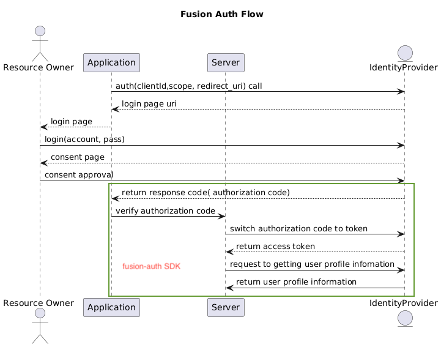

## FusionAuth SDK
### Overview
This library simplifies the process of integrating oauth from various social networks.

### FusionAuth Flow



### Installation
```bash
$ pnpm i fusion-auth
```

### Usages
#### Integrate with Google

```bash
import { OauthProviderFactory, OAuthProviderType } from 'fusion-auth';

const oauthConfig = {
  clientId: process.env.CLIENT_ID || '',
  clientSecret: process.env.CLIENT_SECRET || '',
  redirectUri: process.env.REDIRECT_URI || '',
};
const responseCode = ''

try {
  const googleProvider = OauthProviderFactory.createProvider(
    oauthConfig,
    OAuthProviderType.GOOGLE
  );
  
  const googleUserInfo =  await googleProvider.verifyCode(responseCode);
} catch (error) {
  throw error;
}
```

## Contact
Mail: phanvanhoainam22@gmail.com
